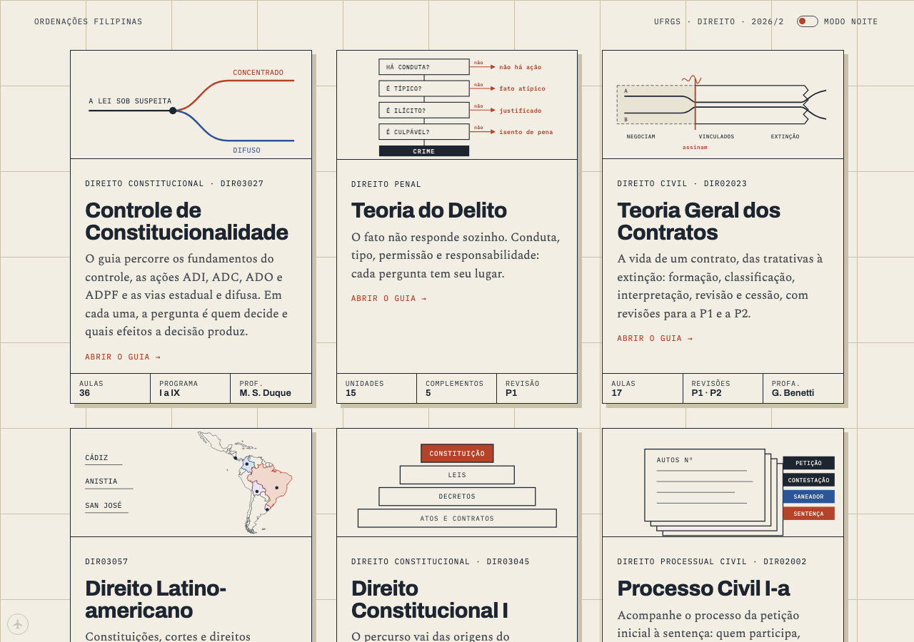
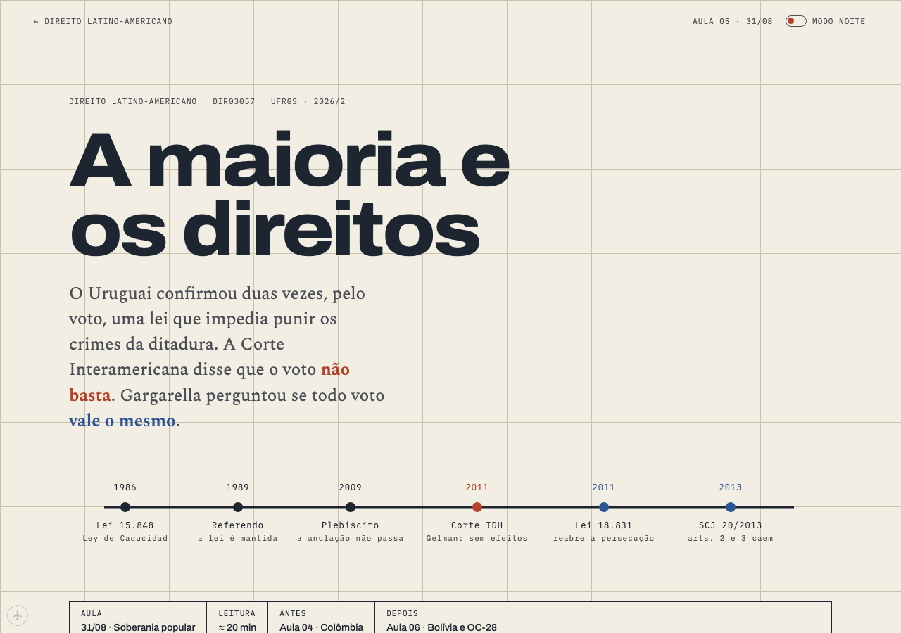

# Benecles

Benecles compiles source material (textbooks, slide decks, case law, syllabi) into structured courses: one topic per sitting, each claim traced to a source, each page checked before it ships. Law is the first subject it has compiled.

**Example output, live:** https://benecles.github.io/ordenacoes-filipinas/ (seven law courses, published as *Ordenações Filipinas · guias de estudo*; content in Portuguese)

|  |  |
|---|---|
|  |  |

## What the compiler does

A course goes through the same passes every time. Each pass leaves files you can open in [`workshop/`](workshop/).

| Pass | What it produces | Where to look |
|---|---|---|
| Shelf | Every source for a course, catalogued by work and chapter | `workshop/work/pipeline/*/shelf.csv` |
| Triage | For each chapter of each source, which lesson it feeds and why: 32,569 rows across four courses | `workshop/work/pipeline/*/triage.csv` |
| Course map | The syllabus as a sequence of one-sitting lessons | `workshop/work/pipeline/*/course-map.md` |
| Blueprint | Per lesson: the question, the cases, the figures, the sources to read (36 so far) | `workshop/work/pipeline/*/compendium/*/blueprint.md` |
| Panel | A second model reviews each blueprint before writing starts (30 reviews) | `workshop/work/pipeline/*/compendium/*/panel.md` |
| Write and draw | Lesson text, and figures drawn for that lesson | `workshop/work/*-build/`, `courses/` |
| Check | Quotations must be found in the sources; prose is linted for padding; house style and layout are checked | `workshop/work/house-style/`, `workshop/work/slop-bench/` |
| Build and ship | Static HTML, search index, catalogue, provenance, offline manifest; one PR per change, CI on every push | `tools/`, `.github/workflows/` |

The method is written up in [`Source Pipeline.md`](workshop/protocols/Source%20Pipeline.md), the writing rules in [`Writing Standard.md`](workshop/protocols/Writing%20Standard.md) and the condensed [`House Manual.md`](workshop/protocols/House%20Manual.md).

## The checks

- **Quotations** (`workshop/work/house-style/quote_check.py`): every quotation on a page must be found in the source texts.
- **Prose** (`workshop/protocols/tools/slop_lint.py`, `workshop/work/slop-bench/`): rules for padded or formulaic Portuguese, each backtested against 368 documents of human legal doctrine so that no more than 10% of human texts trip it. Method and numbers: [`BACKTEST.md`](workshop/work/slop-bench/BACKTEST.md).
- **House style and anatomy** (`workshop/work/house-style/house_check.py`, `workshop/protocols/tools/marks_lint.py`, `tools/anatomy_check.py`): every page carries the shared components; loose prose and late panels are flagged.
- **Build consistency** (`tools/check_all.sh`, run by CI): course fronts regenerate byte-identical, links resolve, the offline manifest matches the tree.
- **Bugs and lessons**: every fix adds a row (symptom, cause, fix, check) to [`workshop/BUGS.md`](workshop/BUGS.md); every lesson learned at a gate becomes a numbered rule in [`workshop/FLIGHT-LOG.md`](workshop/FLIGHT-LOG.md).

## Example output: seven law courses

| Course | Pages |
|---|--:|
| Controle de Constitucionalidade | 37 |
| Teoria do Delito | 42 |
| Direito Constitucional I | 40 |
| Teoria Geral dos Contratos | 22 |
| Processo Civil I-a | 20 |
| Metodologia Jurídica | 13 |
| Direito Latino-americano | 12 |

187 pages, about 1.15 million words and 919 inline SVG figures. Figures are drawn as instruments for the lesson (a deadline on the real calendar, a seating chart of the parties, a statute as a balance) rather than stock flowcharts. Pages read without JavaScript, work offline once visited, and come in light and dark themes. Processo Civil is being rebuilt from scratch as the reference course.

## Built with Claude

Benecles directs the project and decides what ships. The work is done by AI agents under that direction:

- **Claude** (Anthropic, through Claude Code) is the design and editorial lead: it writes the briefs, owns the writing standard and the design system, builds figures and lessons, and gates what ships. [`workshop/CEO.md`](workshop/CEO.md) is its running handoff between sessions.
- **Codex** (OpenAI) does bulk content and engineering work from those briefs, coordinated through GitHub issues, run ledgers (`workshop/RUN-PROC-R2.md`) and pull requests.

Agents work in separate branches and worktrees, and every change passes the same checks. Agent instructions: [`AGENTS.md`](AGENTS.md), [`CLAUDE.md`](CLAUDE.md). The agents are how courses are built, not a feature the reader uses.

## History

It began as one student's study site for the UFRGS law course. This repository holds 680 commits: the site since 2026-09-05 and the pipeline workshop since 2026-09-28, merged with its history intact. [ISSUES.md](ISSUES.md) lists each merged change; `changelog.json` feeds the patch notes on the home page.

The workshop history comes from a private repository. Source texts (book chapters, slides, exams) and personal files were removed from every commit; the shelf and triage files keep the record of what each source was and where it was used.

Earlier design directions are kept: `specimen/` shows each house component in every state, `experiments/` and the prototype pages at the root (`prototype-folio.html`, `index-alt-*.html`) are the original studies, and `VISUAL_CRAFT_NOTES.md` records the design process.

## License

All rights reserved. Nothing here grants reuse of the content.

## Running it

Open `index.html`, or serve the folder (`python3 -m http.server`). Rebuilding a course needs the source texts, which are not in this repository.
